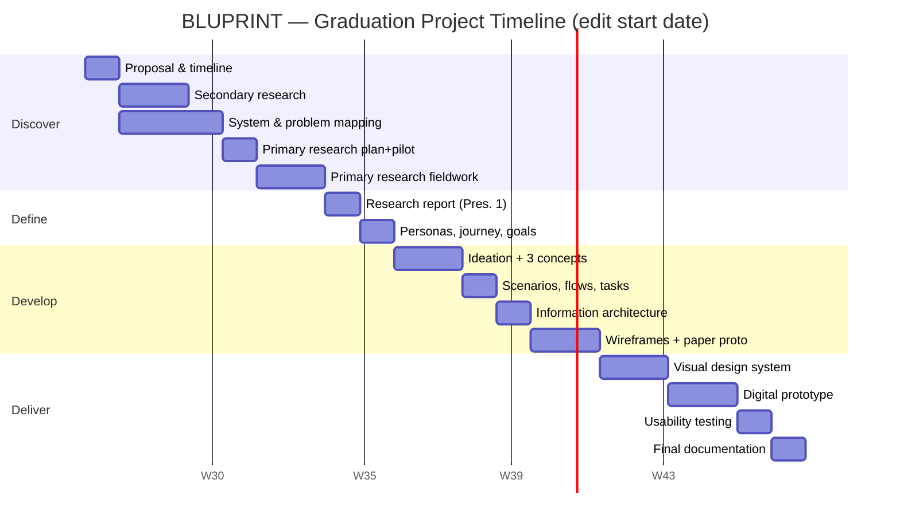

# Part 1 — Project Proposal & Timeline

---

## 1. Project Proposal

### 1.1 Working title
**BLUPRINT — a content intelligence and ideation platform that helps BLUORNG decide what to make for Instagram (organic) and Meta Ads (paid).**

> *Name logic:* "BLU" (from BLUORNG) + "PRINT" (blueprint): a blueprint for every piece of content before a camera is switched on.

### 1.2 Sponsor / context
- **Industry partner:** BLUORNG, a New Delhi streetwear label (founded 2020 by Siddhant Sabharwal and Mokam Singh). Named GQ India's *Streetwear Label of the Year* for 2023. It runs stores in Delhi NCR and Mumbai and sells online, and it has done brand collaborations such as Jägermeister and Budweiser.
- **My role inside the partner:** I work inside BLUORNG's content team, which lets me observe directly how content gets planned, shot, posted and promoted. In this project I am the **UI/UX designer**: I research the content workflow and design a digital product that improves it.
- **Mentors:** Industry mentor (BLUORNG brand/marketing lead) + University guide.

> ⚠️ **Confidentiality:** Any internal data (Instagram Insights, Meta Ads Manager numbers, sales figures, internal docs) must only be used with the written OK of the industry mentor. Anonymise or index numbers (e.g. "Reel A = 100, Reel B = 240") where needed.

### 1.3 Background
BLUORNG grew from an Instagram-first niche label into a fast-rising fashion brand. Its content is a mix of:
- **Organic content:** drop teasers, lookbooks, campaign films, behind-the-scenes, store-launch content, collaborations, community/culture posts.
- **Inorganic (paid) content:** Meta ads (Instagram + Facebook) for drops, retargeting, store footfall and evergreen products.

Today, *what to make next* is decided mostly from experience, gut feel, trend-watching and scattered numbers. The numbers sit in Instagram Insights, Meta Ads Manager and Shopify, while the conversations happen on WhatsApp and in meetings. Nothing connects "what we posted / ran" to "what worked / sold" to "what we should make next".

### 1.4 Problem (initial brief)
> Content teams at drop-led streetwear brands like BLUORNG don't have a structured, evidence-backed way to decide **what content to produce**, both for organic Instagram (formats, series/IPs, stories) and for Meta ads (creative angles, hooks, variations). As a result, creative effort and ad spend are spent on guesswork, wins are not repeated systematically, and organic and paid content run as separate worlds.

### 1.5 Aim
Design a platform that turns **performance data + brand identity + trend signals** into **clear, brand-safe content recommendations and ready-to-shoot briefs**, for both organic and paid content.

### 1.6 Objectives
1. Understand how BLUORNG's content and performance-marketing teams currently ideate, plan, produce, publish and evaluate content.
2. Identify the key pain points and decision gaps in that workflow.
3. Understand what BLUORNG's audience actually engages with, and why.
4. Define a content taxonomy (formats, IPs/series, hooks, angles) the platform can learn from.
5. Generate, evaluate and select a design concept (3 concepts → 1 final).
6. Design the IA, flows, wireframes, UI system and prototype, and test them with real users.

### 1.7 Scope
| In scope | Out of scope |
|---|---|
| Ideation & recommendation for **Instagram organic** (Reels, carousels, stories, series/IPs like ASMR, story experiences, studio diaries) | Actually building the ML model / backend |
| Ideation & recommendation for **Meta Ads** (angles, hooks, formats, variations, fatigue alerts) | Auto-posting / ad buying inside the tool |
| Insight layer (what worked and why), brief generation, content calendar around drops | Other platforms (YouTube, X); these appear only as "future scope" |
| Desktop web app (planning) + mobile companion (on-shoot use) | E-commerce site redesign |

### 1.8 Expected outcome
- A researched, tested **hi-fidelity prototype** of BLUPRINT (web + mobile companion).
- A design system and documented IA.
- A validated set of design recommendations BLUORNG can use even without building the product.

### 1.9 Methodology
**Double Diamond:** Discover (secondary + primary research) → Define (synthesis, personas, problem statement) → Develop (ideation, concepts, IA, wireframes) → Deliver (UI, prototype, usability testing).

### 1.10 Why this matters (value)
| For BLUORNG | For the team | For the audience |
|---|---|---|
| Less wasted production & ad spend; more repeatable wins | Faster decisions, clearer briefs, less back-and-forth | More content they actually want: less noise, more culture |

---

## 2. Project Timeline

> Adjust the week numbers to your college calendar. Presentation 1 = end of research, Presentation 2 = final concept.

| Week | Phase | Stages / Deliverables | Milestone |
|---|---|---|---|
| 1 | Kick-off | Project proposal, timeline, mentor sign-off, confidentiality agreement | ✅ Proposal approved |
| 2–3 | Discover: secondary | Domain study, literature review, competitor/tool analysis | |
| 3–4 | Discover: system | Stakeholder map, system map, problem mapping, problem area & target users | |
| 4 | Plan | Primary research plan, questionnaire draft, **pilot test (3–5 people)**, revise | |
| 5–6 | Discover: primary | Survey (team/industry + audience), interviews, focus group, shadowing a drop week | |
| 7 | Define | Primary research report, data charts, inferences, **redefined brief** | 🎤 **Presentation 1** |
| 8 | Define | Personas, empathy maps, user journey map, problem statement, design goals | |
| 9 | Develop | Ideation (brainstorming, brainwriting, SCAMPER, space saturation) | |
| 10 | Develop | Filtration (bullseye, priority matrix), **3 concepts**, feasibility check, final selection with mentors | |
| 11 | Develop | User scenarios, storyboards, user/task flows, task analysis, feature mapping | |
| 12 | Develop | Information architecture: content strategy, sitemap, navigation, labeling | 🎤 **Presentation 2** |
| 13–14 | Develop | Wireframes, paper prototype + quick test | |
| 15–16 | Deliver | Design system, UI elements, style guide, accessibility checks, grids | |
| 17–18 | Deliver | Wireflows + digital prototype | |
| 19 | Deliver | Usability testing (2 rounds) + iteration | |
| 20 | Final | Documentation, final presentation, jury | 🎓 **Final jury** |

