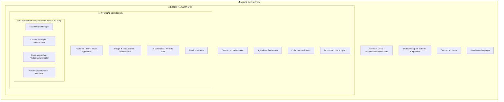
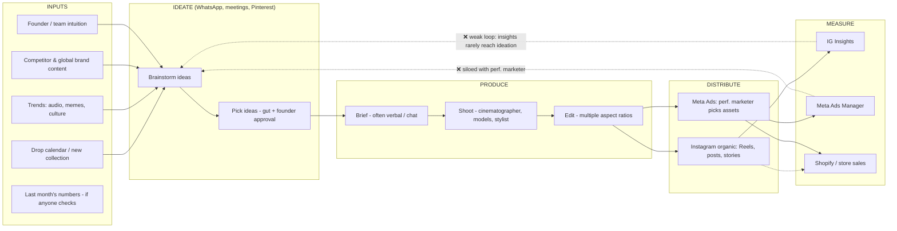
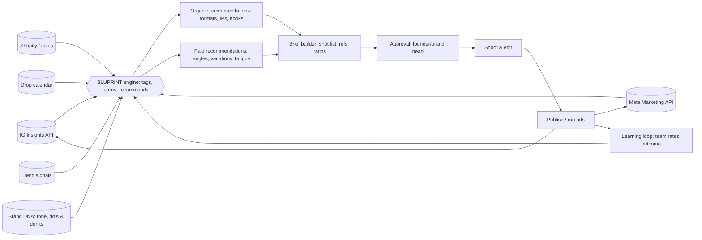
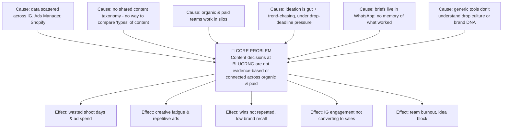

# Part 3 — Stakeholders, System Mapping, Problem Mapping & Target Users

---

## 5. Stakeholders Map

### 5.1 Onion map (core → outer)

### 5.2 Power–Interest grid

| | **Low interest** | **High interest** |
|---|---|---|
| **High power** | Meta (platform rules, algorithm, ad policy) · Collab partners | **Founders / Brand head** (approve budget & brand) · **Performance marketer** (controls spend) |
| **Low power** | Resellers, fan pages · Competitors | **Social media manager, content strategist, cinematographer/editor** (daily users) · Creators/talent · Audience |

**Strategy:** *Manage closely* → founders and performance marketer (show ROI, brand safety). *Keep informed/involve* → content team (co-design with them). *Keep satisfied* → Meta (comply with API & ad policies). *Monitor* → competitors.

### 5.3 Stakeholder needs table
| Stakeholder | Needs from content | Pain today | What BLUPRINT gives them |
|---|---|---|---|
| Founders / Brand head | Brand stays premium; growth; recall | Can't see *why* things work; approvals over WhatsApp | Brand-guard score, clear rationale, one approval view |
| Social media manager | Consistent, fresh calendar | Idea block, trend chasing, manual reporting | Idea bank, IP series planner, auto insights |
| Content strategist / creative lead | Strong concepts, coherent narrative per drop | Briefs scattered; wins not repeated | Brief builder, "what worked" memory |
| Cinematographer / editor | Clear shot lists, references, deadlines | Vague briefs, last-minute changes, re-shoots | Shot list + hook + aspect ratios + references in one brief |
| Performance marketer | Many ad variations, fast; fatigue control | Waits on creative; doesn't know which angle to test next | Angle/hook matrix, fatigue alerts, "promote this organic winner" |
| Design/product team | Product story told well | Content not aligned with drop dates | Drop-calendar-linked content plan |
| Audience | Entertaining, cultural, not salesy | Repetitive ads, generic posts | Better, more varied content (indirect benefit) |

---

## 6. Understanding the System (System Mapping)

### 6.1 Current-state content system ("AS-IS")

**Observations:**

1. **Broken feedback loop:** measurement data rarely flows back into ideation in a structured way.
2. **Organic ↔ paid silo:** the organic team and the performance marketer use different tools and metrics, and organic winners are rarely promoted systematically.
3. **Single point of decision:** founder approval is the bottleneck, and the criteria are taste-based and undocumented.
4. **Memory loss:** what worked last drop lives in people's heads and chat history.
5. **Production is expensive:** every shoot day matters, so wrong ideas are costly.

### 6.2 Future-state system ("TO-BE" with BLUPRINT)

---

## 7. Problem Identification & Analysis (Problems Mapping)

### 7.1 Problem tree

### 7.2 Problem clusters (affinity)
| Cluster | Problems | Severity (H/M/L) |
|---|---|---|
| **A. Knowing what works** | Can't link a post's *type* to its result. Vanity metrics. No benchmark vs own history | **H** |
| **B. Ideation** | Idea block. Trend-chasing feels off-brand. Same ideas repeated | **H** |
| **C. Organic ↔ paid** | Organic winners not promoted. Ads made separately. Different KPIs | **H** |
| **D. Ad creative** | Not enough variations. Fatigue noticed late. Unclear what to test next | **H** |
| **E. Briefing & production** | Vague briefs, re-shoots, missing aspect ratios, last-minute changes | M |
| **F. Planning** | Content not aligned to drop calendar. Last-minute rush before drops | M |
| **G. Approvals** | Founder bottleneck. Taste criteria undocumented | M |
| **H. Brand consistency** | Fear of looking "mass" or salesy. No brand guardrails | M |

### 7.3 5 Whys (example)
1. *Why did the last drop's ads underperform?* → The creatives looked very similar.
2. *Why?* → All were cut from the same lookbook shoot.
3. *Why?* → Only one shoot was planned, focused on the lookbook.
4. *Why?* → Nobody planned ad angles (UGC, detail, social proof) before the shoot.
5. *Why?* → **There's no step that converts "what wins" into a pre-shoot content plan for both organic and paid.** ← the design opportunity.

---

## 8. Defined Problem Area & Target Users

### 8.1 Problem area
> **The ideation-to-brief stage of content creation**, meaning the point where a streetwear brand's team decides *what to make* for Instagram and Meta ads. Today it is disconnected from performance data, brand rules and the drop calendar.

### 8.2 Target users
| Tier | Users | Why |
|---|---|---|
| **Primary** | **In-house content team** (social media manager, content strategist/creative lead) and **performance marketer** | They decide what gets made and run, every week |
| **Secondary** | **Cinematographer / photographer / editor**, **founders/brand head** (approver) | They consume briefs and recommendations and approve |
| **Tertiary** | Agencies, freelancers, creators working with the brand | Receive briefs, need brand context |
| **Indirect beneficiary** | BLUORNG's audience | Gets better, more relevant content |
| **Scale-up market** | Other Indian premium D2C streetwear & fashion brands (5–50 person teams, Instagram-led, drop-based) | Shows the product's viability beyond one client |
