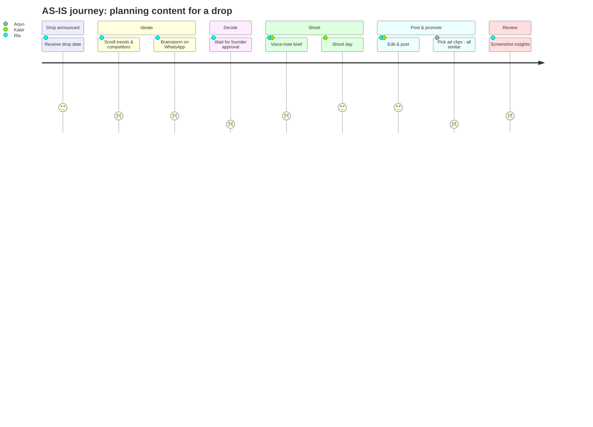

# Part 5 — Personas, Empathy Maps, Journey Map, Problem Statement & Design Goals

> These are **proto-personas** built from secondary research and in-house observation. After your interviews and surveys, update the quotes, numbers and frustrations with real data so they become **data-backed personas**.

---

## 14. Personas

### Persona 1 (Primary): Ria Malhotra, The Strategist
| | |
|---|---|
| **Role** | Social Media Manager, premium streetwear brand (Delhi) |
| **Age** | 26 |
| **Experience** | 4 years, 2 at an agency |
| **Tools** | IG Insights, Meta Business Suite, Notion, WhatsApp, Pinterest, CapCut, ChatGPT |
| **Goals** | Keep the feed fresh and on-brand. Grow reach and saves. Make every drop feel like an event |
| **Frustrations** | "I have Insights open every day, but I can't tell *why* a Reel worked." Idea block before drops. Making reports manually. Founder feedback arrives late on WhatsApp |
| **Behaviours** | Screenshots competitor posts. Keeps a messy Notes app idea list. Checks Reels reach daily |
| **Needs** | Ideas grounded in what works *for us*. A series/IP plan. Instant reporting |
| **Quote** | *"I don't need more data. I need someone to tell me what the data means for next week."* |

### Persona 2 (Primary): Arjun Mehta, The Optimiser
| | |
|---|---|
| **Role** | Performance Marketer (Meta Ads) |
| **Age** | 29 |
| **Experience** | 6 years across D2C brands |
| **Tools** | Meta Ads Manager, Google Sheets, Shopify, Ads Library |
| **Goals** | Hit ROAS targets on drops. Keep CPA stable. Test 10+ creatives a month |
| **Frustrations** | "I get 3 edits from one lookbook shoot and they all look the same." Notices fatigue too late. Has to beg for UGC/creator content |
| **Behaviours** | Data-heavy. Checks Ads Manager several times a day. Keeps a test log in Sheets |
| **Needs** | Angle × hook variation plan *before* the shoot. Fatigue alerts. Quick access to organic winners |
| **Quote** | *"Creative is my targeting now, and I'm always out of creative."* |

### Persona 3 (Secondary): Kabir Singh, The Maker
| | |
|---|---|
| **Role** | Cinematographer / Editor |
| **Age** | 24 |
| **Tools** | Camera, Premiere/DaVinci, CapCut, WhatsApp, Google Drive |
| **Goals** | Shoot beautiful, purposeful content. Avoid re-shoots. Grow his craft |
| **Frustrations** | Briefs are voice notes. Learns about 9:16 + 4:5 + 1:1 needs after the shoot. Last-minute "can we also get…" |
| **Needs** | Clear shot list, hook, references, ratios, deadlines on his phone, on set |
| **Quote** | *"Tell me the story and the hook before I pick up the camera, not after the edit."* |

### Persona 4 (Approver): Siddharth K., The Brand Guardian
| | |
|---|---|
| **Role** | Co-founder / Brand head |
| **Age** | 30 |
| **Goals** | Protect the brand's premium, cultural image. Grow sales and recall |
| **Frustrations** | Too many approval pings. Can't see the bigger picture. Fears the brand looking "mass" |
| **Needs** | One place to approve, with a clear *why* and a brand-fit check |
| **Quote** | *"If it looks like every other brand, it's not us. I don't care how many views it gets."* |

---

## 15. Empathy Maps

### Ria (Strategist)
| **SAYS** | **THINKS** |
|---|---|
| "What's trending this week?" · "That Reel did 3× reach, let's do more like that?" · "I'll send the report tonight" | "Am I just guessing?" · "Will the founders like this?" · "We posted a lot but did it matter?" |
| **DOES** | **FEELS** |
| Scrolls competitors, saves audio, writes ideas in Notes, compiles Insights screenshots into a deck | Pressure before drops · Creative burnout · Proud when a post blows up · Anxious about the algorithm |
| **PAINS** | **GAINS** |
| No link between data and ideas · Manual reporting · Idea block | Confidence in decisions · Repeatable wins · Time to be creative |

### Arjun (Optimiser)
| **SAYS** | **THINKS** |
|---|---|
| "Need 5 new hooks by Thursday" · "Frequency is 4.2, we're burning out" | "The organic team had a great Reel and nobody told me" · "Is it the creative or the audience?" |
| **DOES** | **FEELS** |
| Duplicates ad sets, swaps headlines, logs tests in Sheets | Frustrated waiting on creative · Stressed during drop launches |
| **PAINS** | **GAINS** |
| Few variations · Late fatigue detection · Silos | Predictable CPA · Planned testing pipeline |

### Kabir (Maker)
| **SAYS** | **THINKS** |
|---|---|
| "What's the ratio?" · "Can I get references?" | "This brief changed three times" · "This shot would make a great ASMR ad, but nobody asked" |
| **DOES** | **FEELS** |
| Shoots extra coverage "just in case", re-edits | Undervalued when plans change last minute · Energised on a clear, creative shoot |
| **PAINS** | **GAINS** |
| Vague briefs · Re-shoots | A clear shot list · Creative ownership |

---

## 16. User Journey Map: "Planning content for a new drop" (Ria + Arjun, AS-IS)

| Stage | 1. Drop announced | 2. Ideate | 3. Decide & approve | 4. Brief & shoot | 5. Edit & post | 6. Run ads | 7. Review |
|---|---|---|---|---|---|---|---|
| **Actions** | Gets drop date & products from design team | Scrolls IG, Pinterest, competitors; brainstorms on WhatsApp | Sends ideas to founder; waits | Voice-note brief to cinematographer; one shoot day | Edits multiple versions; schedules posts | Arjun picks clips from the shoot for ads | Screenshots Insights; quick chat |
| **Touchpoints** | Email, meeting | IG, Pinterest, WhatsApp, Notes | WhatsApp | WhatsApp, Drive | CapCut, Premiere, IG | Ads Manager | IG Insights, Ads Manager |
| **Thoughts** | "Only 10 days?" | "What haven't we done yet?" | "Will he like it?" | "Did I mention 9:16?" | "Need one more cut for ads" | "These all look the same" | "Why did that one work?" |
| **Emotion** | 😐 | 😟 | 😬 | 😐 | 🙂 | 😤 | 😕 |
| **Pain points** | Late notice | Idea block, no data link | Approval delay | Vague brief | Re-edits | Low variation, fatigue | No learning saved |
| **Opportunities** | Drop calendar sync | **Data-backed idea recommendations** | Approval with rationale + brand-fit | **Auto-brief + shot list for organic & ads** | Ratio checklist | **Angle × hook matrix, promote organic winners** | **Auto insights → next ideas** |

---

## 17. Problem Statement

**How-Might-We / POV format:**
> **Ria, a social media manager at a premium drop-led streetwear brand,** needs a way to **know what type of content to make next for Instagram and Meta ads**, because **today performance data, ideas, briefs and the drop calendar live in separate places, so content decisions are guesswork, wins aren't repeated, and ads run out of fresh creative.**

**Final problem statement:**
> *Content teams at drop-led fashion brands like BLUORNG lack a connected, brand-aware system that turns their own organic and paid performance data into clear, explainable ideas and shootable briefs. This leads to guess-based content, repetitive ads, wasted production and spend, and weak learning between drops.*

**How Might We…**

1. HMW help the team understand *why* a piece of content worked, by type, not just by number?
2. HMW turn insights into fresh, on-brand ideas for Instagram series/IPs?
3. HMW help performance marketers plan diverse ad angles *before* the shoot?
4. HMW make one shoot feed both organic and paid?
5. HMW make briefs so clear that makers never need a re-shoot?
6. HMW keep AI suggestions on-brand and trustworthy?

---

## 18. Defined Design Goals

| # | Design goal | Success metric (to test in usability study) |
|---|---|---|
| G1 | **Make performance meaningful:** show what worked by content type, in plain language | User can name the top-performing IP & why in < 1 min |
| G2 | **Recommend, don't dictate:** explainable, editable idea suggestions | ≥ 80% of testers understand *why* an idea was suggested |
| G3 | **Bridge organic & paid:** one plan, one shoot, both outputs | Ad variations planned per shoot ↑ (e.g. 3 → 10) |
| G4 | **Brief in one click:** shot list, hook, ratios, references | Brief created in < 5 min; makers rate clarity ≥ 4/5 |
| G5 | **Protect the brand:** guardrails and brand-fit scoring | Founder approves ≥ 70% of suggestions without major edits |
| G6 | **Plan around drops:** calendar-first view | Drop plan visible 2+ weeks ahead |
| G7 | **Learn continuously:** feedback loop from results to ideas | Insight → idea links visible in the UI |
| G8 | **Fit the context:** desktop for planning, mobile for set and approvals | Key tasks doable on mobile |
| G9 | **Accessible & inclusive:** WCAG 2.2 AA | Contrast & touch targets pass checks |
