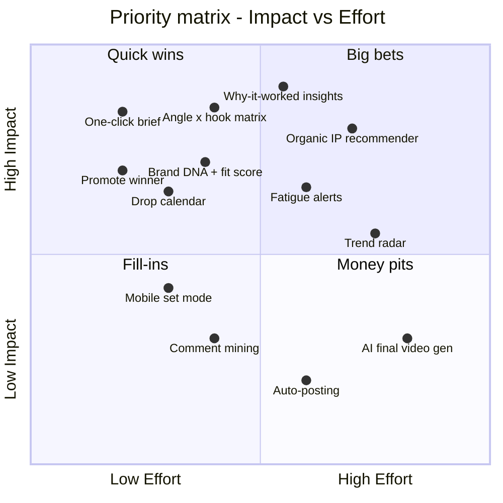

# Part 6 — Ideation, Filtration, 3 Concepts & Final Selection

---

## 19. Ideation Techniques

### 19.1 Brainstorming (HMW-driven, 40+ raw ideas)
| HMW | Ideas |
|---|---|
| **HMW1** understand *why* content worked | Auto-tag every post by format/IP/hook/emotion · "Why it worked" cards · Compare to own median · Hook heatmap (retention curve) · Weekly AI digest on WhatsApp · Leaderboard of IPs · "Content DNA" fingerprint per post |
| **HMW2** fresh on-brand organic ideas | IP/series recommender · Idea bank with tags · Trend radar filtered by brand-fit · "Remix a winner" button · Audience question-mining from comments/DMs · Collab idea generator · Seasonal/culture calendar (festivals, music drops, cricket, fashion weeks) · Story Experience builder (polls, quizzes) |
| **HMW3** diverse ad angles | Angle × hook matrix · "Missing angles" alert · Fatigue predictor · Variation generator (same footage, new hooks/captions) · Competitor ad swipe file · Creator/UGC brief generator |
| **HMW4** one shoot → both outputs | Shoot planner that merges organic + ad shots · "Ad-ready" checklist per shot (ratios, hook frames, safe zones) · Promote-winner pipeline |
| **HMW5** clear briefs | One-click brief · Shot list with reference frames · Mobile "set mode" with checkboxes · Voice-note-to-brief converter · Moodboard auto-pull |
| **HMW6** on-brand & trustworthy | Brand DNA setup · Brand-fit score · "Never suggest" list · Explain-why panel · Thumbs up/down learning · Founder approval queue |

### 19.2 Brainwriting (6-3-5)
6 participants (BLUORNG team + design peers) × 3 ideas × 5 rounds of building on each other's ideas. Example chain:

| Round 1 | Round 2 (builds on) | Round 3 (builds on) |
|---|---|---|
| "Show which Reels worked" | "…tag them by IP so we compare series, not posts" | "…and suggest the next episode of the winning series" |
| "Ad fatigue warning" | "…with a suggested replacement from organic winners" | "…auto-create a brief to shoot new hooks for it" |
| "Better briefs" | "…brief generated from the chosen idea" | "…with a mobile on-set checklist and ratios" |

### 19.3 SCAMPER (applied to the current workflow and existing tools)
| Letter | Prompt | Idea |
|---|---|---|
| **S**ubstitute | Replace WhatsApp briefs with…? | Structured mobile brief cards |
| **C**ombine | Combine IG Insights + Ads Manager + calendar? | One "Pulse" board for organic + paid |
| **A**dapt | Adapt Spotify's "Discover Weekly"? | **"Ideas Weekly"**: personalised idea drop every Monday |
| **M**odify / Magnify | Magnify the hook (first 3 s)? | Hook library + hook-level performance |
| **P**ut to other use | Use organic Reels for ads? | "Promote winner" → ad variation plan |
| **E**liminate | Eliminate manual reporting? | Auto weekly digest |
| **R**everse / Rearrange | Plan ads *before* the shoot instead of after | Shoot planner that starts from ad angles |

### 19.4 Space Saturation & Group (affinity of all ideas)
All ideas on sticky notes → grouped into themes:

| Theme cluster | Ideas grouped |
|---|---|
| 🔍 **Insight** | Auto-tagging, why-it-worked, IP leaderboard, hook heatmap, digest |
| 💡 **Ideate** | IP recommender, trend radar, remix a winner, Ideas Weekly, comment mining, collab generator |
| 🎯 **Paid creative** | Angle × hook matrix, missing angles, fatigue predictor, variation generator, UGC brief |
| 📝 **Brief & produce** | One-click brief, shot list, set mode, voice-to-brief, moodboard |
| 📅 **Plan** | Drop calendar, culture calendar, shared organic + paid timeline |
| 🛡️ **Brand & trust** | Brand DNA, brand-fit score, explain-why, feedback loop, approvals |

### 19.5 Crazy 8s (rapid sketches)
8 sketches in 8 minutes for the home screen: (1) feed of idea cards, (2) calendar-first, (3) dashboard-first, (4) chat co-pilot, (5) Tinder-style swipe on ideas, (6) kanban idea → brief → shot → live, (7) "Drop Room" per drop, (8) mobile set mode. *Add your hand sketches here.*

---

## 20. Ideation Filtration

### 20.1 Bullseye diagram
| Ring | Ideas |
|---|---|
| 🎯 **Core: must have** | Auto-tagging by content type · "Why it worked" insights · Organic IP/format recommender · Paid angle × hook matrix · One-click brief · Brand DNA + brand-fit score · Explain-why on every suggestion |
| ⭕ **Middle: should have** | Drop calendar (organic + paid) · Promote-winner pipeline · Fatigue alerts · Mobile set mode · Approval queue · Ideas Weekly digest |
| ⚪ **Outer: nice to have** | Trend radar · Comment/DM mining · Competitor swipe file · Hook heatmap · Collab generator |
| ❌ **Parked** | Auto-posting · Auto ad buying · AI-generated final videos · Influencer marketplace |

### 20.2 Priority matrix (Impact vs Effort)

| Quadrant | Ideas |
|---|---|
| **Quick wins** (high impact, low effort) | One-click brief, promote winner, angle × hook matrix, brand DNA, drop calendar |
| **Big bets** (high impact, high effort) | Why-it-worked insights, organic IP recommender, fatigue alerts, trend radar (later phase) |
| **Fill-ins** | Mobile set mode, comment mining |
| **Money pits** (avoid) | Auto-posting, AI final video generation |

---

## 21. Three Concepts

### Concept A: "PULSE", the insight-first dashboard
**Idea:** An analytics dashboard that pulls IG + Meta + Shopify data, auto-tags content, and shows *what worked and why* with a ranked list of recommendations.

| Aspect | Detail |
|---|---|
| Home | KPIs + IP leaderboard + "This week's 5 recommendations" |
| Strength | Strong data foundation; great for Arjun and founders |
| Weakness | Doesn't help with *creating* ideas or briefs; Ria and Kabir still go to WhatsApp |
| Tech | Graph API + Marketing API, tagging model, charts |
| Feasibility | ✅ High (data APIs exist) |
| Risk | Becomes "another dashboard nobody opens" |

### Concept B: "STUDIO", the ideation co-pilot
**Idea:** An AI co-pilot where the team picks a goal (e.g. "Drop hype for the Winter capsule") and gets brand-fit ideas for organic IPs and ad angles, each with hook, format and reason, plus a one-click brief.

| Aspect | Detail |
|---|---|
| Home | Idea feed + prompt bar ("I need…") + idea bank |
| Strength | Solves idea block; loved by Ria and Kabir; creates briefs |
| Weakness | Without solid insight data, ideas can be generic; trust depends on explanations |
| Tech | LLM + brand DNA prompt + performance context |
| Feasibility | ✅ Medium–high |
| Risk | Generic AI ideas → rejection by brand guardian |

### Concept C: "DROP ROOM", the calendar-first command centre
**Idea:** Everything is organised around **drops**. Each drop gets a "room" with a timeline (T-14 to T+14), planned organic content, ad variations, shoot plan and approvals.

| Aspect | Detail |
|---|---|
| Home | Drop calendar + active drop rooms |
| Strength | Matches how BLUORNG actually works; bridges organic + paid; great for coordination |
| Weakness | Weak on *why* and on idea generation; mostly a planning tool (overlaps with Notion) |
| Tech | Calendar, tasks, integrations |
| Feasibility | ✅ High |
| Risk | Seen as "just a project management tool" |

### 21.1 Concept evaluation matrix (score 1–5, weighted)
| Criterion (weight) | A: Pulse | B: Studio | C: Drop Room |
|---|---|---|---|
| Solves "what to make" (25%) | 3 | **5** | 2 |
| Uses brand's own data (15%) | **5** | 3 | 2 |
| Organic ↔ paid bridge (15%) | 3 | 4 | **5** |
| Brief/production help (10%) | 1 | **5** | 4 |
| Brand safety & trust (10%) | 4 | 3 | 4 |
| Fits workflow / adoption (10%) | 2 | 4 | **5** |
| Technical feasibility (10%) | **5** | 4 | **5** |
| Cost / time to build (5%) | 4 | 3 | **5** |
| **Weighted total** | **3.35** | **4.05** | **3.60** |

*(Re-score this table with your mentors and concept-probe participants. These are draft scores.)*

---

## 22. Final Concept: BLUPRINT = Studio core + Pulse brain + Drop Room spine

**Selected direction:** **Concept B (Studio)** as the core experience, powered by **A's insight engine** (so ideas come from real data, not generic AI) and organised on **C's drop timeline** (so it fits how BLUORNG works).

### 22.1 Justification
1. **Against research needs:** It addresses the top 3 priority areas (knowing what works → Pulse; ideation → Studio; organic ↔ paid → Drop Room) and the adoption conditions (explainable, brand-safe, editable).
2. **Against viability:**
   - *Technology:* Instagram Graph API and Meta Marketing API provide post and ad metrics. LLMs can produce ideas and briefs. Tagging can start manually or semi-automatically.
   - *Cost/time:* An MVP can be built as a web app on existing APIs. No custom hardware.
   - *Process:* It fits the existing weekly planning and drop cycle; it doesn't replace people.
   - *Modularity:* Modules (Pulse, Ideas, Briefs, Plan, Brand DNA) can ship one at a time.
   - *Accessibility:* WCAG 2.2 AA, mobile companion for on-set use.
3. **Mentor input:** *(Add: "Industry mentor emphasised…", "University guide suggested…")*

### 22.2 Low-fidelity mock-up plan
- Paper prototype of: Home (Ideas feed), Idea detail (with *why*), Brief builder, Drop timeline, Pulse board, Mobile set mode.
- Test with 3 team members using 3 tasks (see Part 7, Task Analysis).
