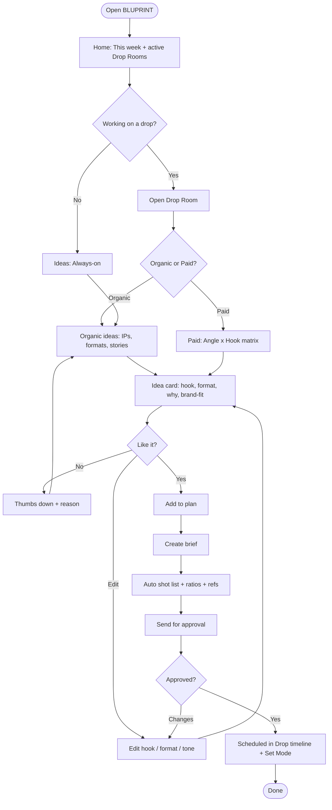
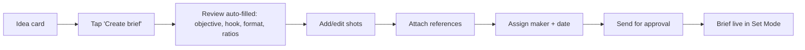
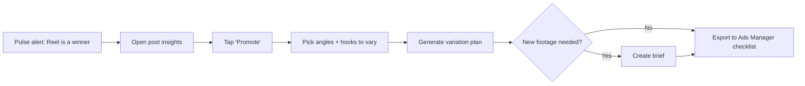
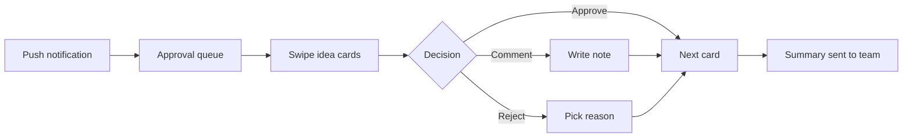

# Part 7 — User Scenarios, Storyboards, User & Task Flows, Task Analysis, Feature Mapping

---

## 23. User Scenarios

### Scenario 1: Ria plans organic content for a drop (primary)
*Monday, 10 AM. The "Winter Capsule" drops in 12 days.* Ria opens BLUPRINT on her laptop. The **Drop Room** already shows the drop date, synced from the design team. She opens **Ideas → Organic**. BLUPRINT suggests *"ASMR: Embroidery Close-ups, Ep. 4"*, with the reason: "Your ASMR series averages **2.6× saves** vs your median; last episode was 5 weeks ago." It also suggests a **Story Experience: "Pick the colourway"** poll for T-7. She tweaks the hook, sees a **Brand-fit 92%** badge, and adds both to the drop plan. Then she clicks **Create brief**.

### Scenario 2: Arjun plans ad variations before the shoot
Arjun opens the same Drop Room → **Paid**. The **Angle × Hook matrix** shows that last drop used only *Lookbook* and *Scarcity* angles. **Craft/Detail** and **Creator try-on** are flagged as "missing angles". BLUPRINT also spots that Ria's ASMR Reel is an organic winner and suggests "Promote as ad + shoot 3 alternate hooks". Arjun adds 4 angles × 3 hooks = 12 variations to the **shoot plan**, so Kabir shoots for them on the same day.

### Scenario 3: Kabir on set
On shoot day, Kabir opens BLUPRINT on his phone in **Set Mode**. He sees one merged shot list (organic + ads) with hooks, ratios (9:16, 4:5), safe zones and reference frames. He ticks off shots as he goes. A note pops: "Shot 7 needs a 2-sec close-up for Hook B".

### Scenario 4: Founder approval
Siddharth gets a notification: "Winter Capsule plan ready: 9 organic, 12 ad variations." He swipes through cards on mobile. Each shows the idea, the *why*, a reference and the brand-fit score. He approves 8, comments "make the tone less meme-y" on one, and rejects one. BLUPRINT learns from the rejection.

### Scenario 5: Review & learn (post-drop)
At T+7, BLUPRINT's **Pulse** digest says: "Creator try-on ads had **38% lower CPA (indexed)** than lookbook ads; ASMR Ep. 4 is your top-saved post this month." It suggests next steps: "Make ASMR a bi-weekly IP" and "Brief 2 more creators for the next drop."

---

## 24. Storyboards

*Draw these as 6-frame comic strips (pen sketches are fine for jury).*

**Storyboard 1: "From idea block to drop plan" (Ria)**
| Frame | Visual | Caption |
|---|---|---|
| 1 | Ria staring at a blank Notion page, phone buzzing with "drop in 12 days" | Idea block before a drop |
| 2 | Ria scrolling competitors, frustrated | Trend-chasing feels off-brand |
| 3 | Opens BLUPRINT → Drop Room | Everything for the drop in one place |
| 4 | Idea card: "ASMR Ep. 4 — 2.6× saves" with *why* | Ideas based on what works for *us* |
| 5 | Taps "Create brief" → brief appears | Brief in one click |
| 6 | Ria relaxed; founder replies "Approved 🔥" | Confident, fast, on-brand |

**Storyboard 2: "One shoot, twelve ads" (Arjun + Kabir)**
| Frame | Visual | Caption |
|---|---|---|
| 1 | Arjun looking at 3 near-identical ads, frequency 4.2 | Creative fatigue |
| 2 | BLUPRINT matrix highlights "missing angles" | See the gaps |
| 3 | Arjun adds angles + hooks to shoot plan | Plan ads before the shoot |
| 4 | Kabir on set, phone in Set Mode, ticking shots | Clear shot list on set |
| 5 | Ads Manager with 12 varied ads | Real diversity |
| 6 | Pulse: CPA down, Arjun smiling | Learn and repeat |

---

## 25. User Flows & Task Flows

### 25.1 Primary user flow: get an idea → brief → plan


### 25.2 Task flow: create a brief from an idea (linear)


### 25.3 Task flow: promote an organic winner to ads


### 25.4 Task flow: approve a plan (founder, mobile)


---

## 26. Task Analysis

### 26.1 Hierarchical Task Analysis (HTA): "Plan content for a drop"
```
0. Plan content for a drop
   1. Open the drop
      1.1 Open Drop Room from Home
      1.2 Check drop date, products, goals
   2. Get organic ideas
      2.1 Open Organic tab
      2.2 Filter by goal (hype / saves / reach)
      2.3 Read idea card + "why"
      2.4 Edit or give feedback
      2.5 Add to plan
   3. Plan paid variations
      3.1 Open Paid tab → Angle × Hook matrix
      3.2 Review missing angles + fatigue alerts
      3.3 Select angles × hooks
      3.4 Add to shoot plan
   4. Create briefs
      4.1 Create brief from idea
      4.2 Review shot list, ratios, references
      4.3 Assign maker & date
   5. Get approval
      5.1 Send plan to approver
      5.2 Resolve comments
   6. Execute & learn
      6.1 Shoot with Set Mode
      6.2 Publish / launch ads (outside BLUPRINT)
      6.3 Review Pulse digest → feedback

Plan 0: do 1 → (2 and 3 in any order) → 4 → 5 → 6
```

### 26.2 Task table (for usability testing later)
| Task | User | Frequency | Current time (est.) | Target time | Key screen |
|---|---|---|---|---|---|
| Find which content type worked best last month | Ria, founder | Weekly | 30–60 min (manual) | < 1 min | Pulse |
| Get 5 organic ideas for a drop | Ria | Weekly | 1–2 hrs | < 10 min | Ideas → Organic |
| Plan 10 ad variations | Arjun | Per drop / bi-weekly | 1 hr + waiting | < 15 min | Paid matrix |
| Create a brief | Ria/Arjun | 5–10× per drop | 20–30 min | < 5 min | Brief builder |
| Use brief on set | Kabir | Shoot days | – | Glanceable | Set Mode (mobile) |
| Approve a plan | Founder | Per drop | Days (WhatsApp) | < 10 min | Approval queue (mobile) |

*Current times are estimates. Replace them with times observed during shadowing.*

---

## 27. Feature Mapping

| Feature | User need (from research) | Persona | Design goal | Priority | Module |
|---|---|---|---|---|---|
| Auto-tagging (format, IP, hook, emotion, goal) | Know what works by type | Ria, Arjun | G1 | Must | Pulse |
| "Why it worked" cards | Meaning, not numbers | Ria, Founder | G1, G2 | Must | Pulse |
| IP leaderboard | Compare series | Ria | G1 | Must | Pulse |
| Weekly digest | No manual reports | Ria, Founder | G7 | Should | Pulse |
| Organic idea recommender (IPs, formats, stories) | Idea block | Ria | G2 | Must | Ideas |
| Story Experience builder | Interactive stories | Ria | G2 | Should | Ideas |
| Angle × Hook matrix + missing angles | Ad diversity | Arjun | G3 | Must | Ideas → Paid |
| Fatigue alerts | Late detection | Arjun | G3, G7 | Should | Pulse → Paid |
| Promote winner | Organic → paid | Arjun | G3 | Must | Pulse/Ideas |
| Explain-why + edit + feedback | Trust | All | G2, G7 | Must | All |
| One-click brief + shot list | Clear briefs | Ria, Kabir | G4 | Must | Briefs |
| Set Mode (mobile) | On-set use | Kabir | G4, G8 | Should | Briefs |
| Drop Room + timeline | Plan around drops | Ria, Arjun | G6 | Must | Plan |
| Approval queue (mobile) | Fast approvals | Founder | G5, G8 | Should | Plan |
| Brand DNA + brand-fit score | Protect the cool | Founder | G5 | Must | Brand DNA |
| Trend radar (brand-filtered) | Trends without losing brand | Ria | G2, G5 | Could | Ideas |
| Comment/DM question mining | Audience voice | Ria | G2 | Could | Pulse |
