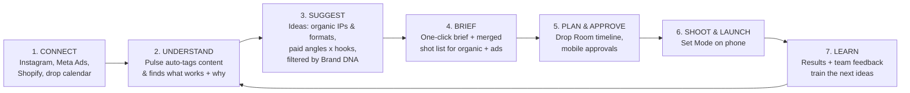

# Part 8 — Information Architecture & Proposed Solution

---

## 28. Content Strategy & Analysis

### 28.1 Content goals of the product
1. **Answer one question fast:** *"What should we make next, and why?"*
2. Turn data into **plain-language guidance** (no analytics jargon for makers and founders).
3. Keep **brand voice** visible everywhere (BLUORNG tone, not generic AI tone).

### 28.2 Content inventory (what information lives in BLUPRINT)
| Content object | Contains | Source | Updated |
|---|---|---|---|
| **Post / Ad** | Media, caption, date, metrics, tags | IG Graph API, Meta Marketing API | Daily |
| **Tag set** | Format, IP/series, hook type, emotion, goal, angle | Auto + manual | On import |
| **Insight** | Finding + evidence + comparison to median | Pulse engine | Weekly / on demand |
| **Idea** | Title, format, IP, hook, why, brand-fit score, refs, goal | Ideas engine + team | Weekly + on request |
| **Brief** | Objective, idea, shot list, ratios, refs, caption draft, owner, deadline, usage rights | Generated + edited | Per idea |
| **Drop** | Name, date, products, goals, timeline, linked ideas/briefs | Design team / manual | Per drop |
| **Brand DNA** | Tone words, do's & don'ts, visual refs, banned words/topics, colour & type rules | Founder + team | Rarely |
| **Approval** | Status, comments, approver | Team | Per idea/plan |

### 28.3 Content types for recommendations (taxonomy used across the product)
- **Organic formats:** Reel · Carousel · Static · Story · Story Experience (interactive) · Collab post · Broadcast message
- **Organic IPs (series):** Drop Countdown · Lookbook / Campaign Film · ASMR · Studio Diaries · One Piece Three Ways · Fit Check · Collab Universe · Culture Drop · Founder POV · UGC Wall
- **Paid angles:** Scarcity/Drop · Craft & Quality · Social Proof · Creator / UGC · Lookbook Carousel · Retargeting/DPA · Store Footfall · Collab Announce
- **Hook types:** Visual shock · Close-up detail · Question · Text overlay claim · Sound-led (ASMR) · POV · Behind-the-scenes reveal · Countdown
- **Goals:** Hype · Reach · Saves · Shares · Sales · Footfall · Recall

### 28.4 Voice & tone of the UI
| Do | Don't |
|---|---|
| Short, confident, culture-aware ("This one hit. Make more.") | Corporate ("Engagement metrics indicate…") |
| Explain with evidence ("2.6× your median saves") | Vague ("Performing well") |
| Suggest ("Try…", "Consider…") | Command ("You must post…") |

---

## 29. Organisation

### 29.1 Organisation schemes
| Scheme | Used for |
|---|---|
| **Task-based** (primary) | Top-level navigation: Pulse → Ideas → Briefs → Plan |
| **Time-based** | Drop timeline (T-14 … T+14), calendar |
| **Topic-based** | Content type / IP / angle filters |
| **Audience-based** | Organic vs Paid tabs |

### 29.2 Card sorting plan (to validate labels and groups)
- **Open card sort** with 6–8 team/practitioners: 30 cards (e.g. "IP leaderboard", "Fatigue alert", "Shot list", "Brand-fit score"). Let them group and name the groups.
- **Closed card sort** with 10+ to confirm the final top-level groups.
- Tools: Optimal Workshop, Maze or paper cards. Output: similarity matrix → confirm the sitemap.

---

## 30. Structuring: Sitemap

```mermaid
flowchart TB
    ROOT((BLUPRINT))
    ROOT --> HOME[🏠 Home]
    ROOT --> PULSE[📈 Pulse]
    ROOT --> IDEAS[💡 Ideas]
    ROOT --> BRIEFS[📝 Briefs]
    ROOT --> PLAN[📅 Plan]
    ROOT --> BRAND[🧬 Brand DNA]
    ROOT --> SET[⚙️ Settings]

    HOME --> H1[This week: top 3 ideas]
    HOME --> H2[Active Drop Rooms]
    HOME --> H3[Alerts: winners, fatigue, approvals]

    PULSE --> P1[Overview: organic + paid]
    PULSE --> P2[IP & format leaderboard]
    PULSE --> P3[Post / Ad detail + Why it worked]
    PULSE --> P4[Paid: angles, hooks, fatigue]
    PULSE --> P5[Weekly digest]

    IDEAS --> I1[Organic: IPs, formats, Story Experiences]
    IDEAS --> I2[Paid: Angle x Hook matrix]
    IDEAS --> I3[Ask BLUPRINT - prompt]
    IDEAS --> I4[Idea bank - saved]
    IDEAS --> I5[Idea detail: why, refs, brand-fit, edit]

    BRIEFS --> B1[All briefs - by status]
    BRIEFS --> B2[Brief builder]
    BRIEFS --> B3[Shoot plan - merged shot list]
    BRIEFS --> B4[Set Mode - mobile]

    PLAN --> L1[Calendar - organic + paid]
    PLAN --> L2[Drop Rooms]
    L2 --> L21[Drop timeline T-14..T+14]
    L2 --> L22[Drop: organic plan]
    L2 --> L23[Drop: paid plan]
    L2 --> L24[Drop: briefs & shoot]
    PLAN --> L3[Approvals queue]

    BRAND --> D1[Tone & voice]
    BRAND --> D2[Visual references]
    BRAND --> D3[Do's & Don'ts / never-suggest list]
    BRAND --> D4[Products & collections]

    SET --> S1[Integrations: Instagram, Meta Ads, Shopify]
    SET --> S2[Team & roles]
    SET --> S3[Notifications]
```

**Mobile companion (subset):** Home · Approvals · Set Mode · Ideas (quick capture) · Pulse digest

---

## 31. Navigation

| Level | Desktop (planning) | Mobile companion (set & approvals) |
|---|---|---|
| **Global** | Left sidebar: Home, Pulse, Ideas, Briefs, Plan, Brand DNA, Settings, plus Drop switcher at the top | Bottom tab bar (5): Home · Ideas · **+ Capture** · Approvals · Set Mode |
| **Local** | Tabs inside modules (e.g. Ideas: Organic / Paid / Bank) | Segmented controls |
| **Contextual** | "Create brief", "Promote", "Add to drop" buttons on cards; cross-links Insight ↔ Idea ↔ Brief | Swipe actions on cards |
| **Utility** | Search (⌘K), notifications, profile | Search, notifications |
| **Breadcrumbs** | Plan › Winter Capsule › Paid | – |
| **Wayfinding** | Active drop pinned in the header; status chips (Idea → Brief → Approved → Shot → Live) | Progress bar in Set Mode |

**Navigation principles:** max 7 top-level items · every insight links to an action · drop context is always visible · ≤ 3 clicks from Home to a brief.

---

## 32. Labeling

| Label | Meaning | Alternatives considered | Why chosen |
|---|---|---|---|
| **Pulse** | Performance insights | Analytics, Dashboard, Insights | Short, energetic, feels "alive", less intimidating for makers. *Test vs "Insights"* |
| **Ideas** | Recommendations | Suggestions, Recommendations, Studio | Plain and action-oriented |
| **Briefs** | Shootable briefs & shot lists | Tasks, Production, Jobs | The team already says "brief" |
| **Plan** | Calendar + drops + approvals | Calendar, Schedule | Covers more than dates |
| **Drop Room** | Workspace per drop | Campaign, Project | Matches streetwear culture ("drops") |
| **Brand DNA** | Brand guardrails | Brand guide, Rules | Memorable; signals identity |
| **IP / Series** | Recurring content format | Show, Segment, Pillar | "IP" is used in-house; tooltip: "a repeatable series" |
| **Angle** | Ad message strategy | Concept, Theme | Standard performance-marketing term |
| **Hook** | First 1–3 seconds | Opener, Intro | Industry standard |
| **Brand-fit** | How on-brand an idea is (0–100) | Brand score, Vibe check | Clear; "Vibe check" kept as a playful tooltip |
| **Why this?** | Explanation of a recommendation | Reason, Rationale | Conversational and inviting |
| **Promote** | Turn organic into ad | Boost, Amplify | "Boost" means a specific Meta feature, so we avoid confusion |
| **Set Mode** | On-set mobile view | Shoot view, Checklist | Short; set = film set |

*Labels to validate in card sorting and first-click tests: Pulse vs Insights, IP vs Series.*

---

## 33. Proposed Solution: BLUPRINT

### 33.1 One-liner
> **BLUPRINT tells BLUORNG's content team what to make next, for Instagram and Meta ads, and why, then turns it into a brief they can shoot.**

### 33.2 How it works

### 33.3 Core modules
| Module | What it does | Organic | Paid |
|---|---|---|---|
| **Pulse** | Shows what worked & why, by content type | IP leaderboard, format/hook performance, saves/shares | Angle/hook CPA (indexed), fatigue, winners |
| **Ideas** | Explainable, brand-fit recommendations | IPs (ASMR, Story Experience, Studio Diaries…), formats, hooks, culture moments | Angle × Hook matrix, missing angles, variation plans, promote-winner |
| **Briefs** | Brief + shot list + Set Mode | Reels/carousel/story briefs | Variation shot list, ratios, safe zones, creator briefs |
| **Plan** | Drop Rooms, calendar, approvals | Content timeline | Ad flighting & refresh dates |
| **Brand DNA** | Guardrails for every suggestion | Tone, visual refs, never-suggest | No discount-led ads, premium tone |

### 33.4 Platforms
- **Web app (desktop-first):** planning, analysis, ideation.
- **Mobile companion (iOS/Android):** approvals, Set Mode, quick idea capture, digest.

### 33.5 Value summary
| Stakeholder | Before | After (target) |
|---|---|---|
| Social media manager | Guessing, idea block, manual reports | Data-backed ideas weekly, auto digest |
| Performance marketer | 3 similar ads per drop, late fatigue | 10+ planned variations, early alerts |
| Maker | WhatsApp voice-note briefs | Clear shot list on phone |
| Founder | Approvals scattered, brand risk | One queue, brand-fit score, rationale |
| Business | Spend on guesswork | More repeatable wins, better CPA, stronger recall |

### 33.6 Next stages (after this document)
Wireframes → paper prototype test → design system (colour, type, icons) → style guide & interaction patterns → accessibility (WCAG 2.2 AA, iOS HIG, Material 3) → grids → wireflows & digital prototype → usability testing (2 rounds).
